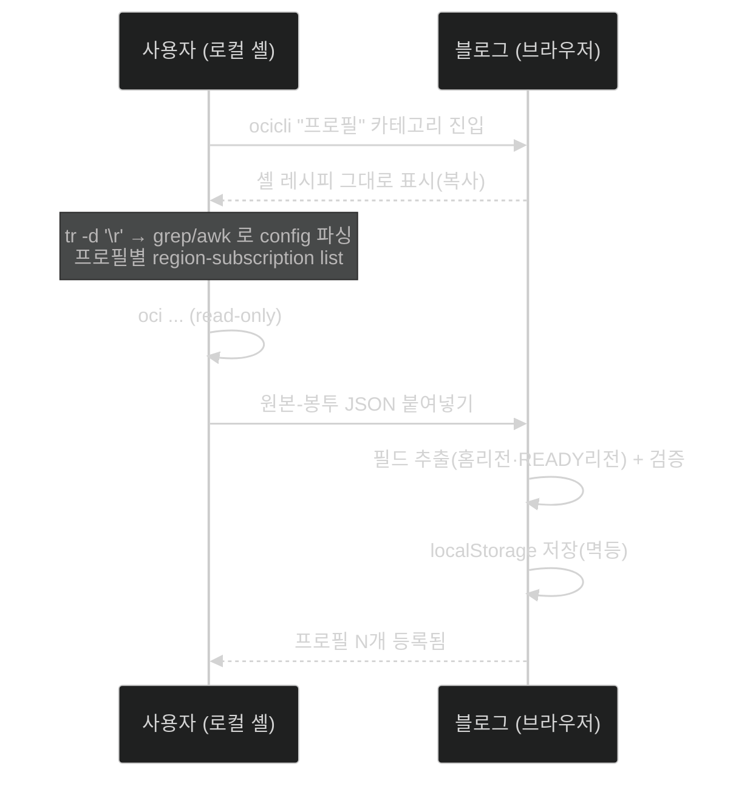

# OCI CLI 프로필 저장·불러오기 — 설계서

- 문서 성격: 설계 앵커 (구현 전 합의용). 승인 후 이 문서를 기준으로 구현.
- 작성: 2026-08-30
- 대상 화면: 지식모음 › OCI CLI 빌더 (`src/pages/CliBuilderPage.tsx`)

---

## 0. 한 줄 정의

> `--profile` 과 리전을 **매번 타이핑하는 피로를 없앤다.**
> 로컬 `~/.oci/config` 를 기준으로 프로필을 **한 번 수집해 저장**하고,
> 빌더 상단에서 **골라 쓰면** `--profile` 자동 주입 + 리전 후보가 **그 테넌시의 가용 리전으로 좁혀진다.**

---

## 1. 설계를 지배하는 제약 (linchpin)

블로그는 **정적 SPA (GitHub Pages)** 다. 브라우저 샌드박스는 로컬 파일(`~/.oci/config`)도, 로컬 프로세스(`oci`)도 직접 만질 수 없다. 그래서 "수집"은 반드시 이 왕복이 된다:

```
블로그가 스크립트 생성  →  사용자가 로컬에서 실행  →  출력(JSON) 붙여넣기  →  블로그가 파싱·저장
```

이건 새 패러다임이 아니라 **이 사이트가 이미 쓰는 블루프린트 엔진의 "bash 생성 → 로컬 실행 → 결과 Import"** 와 정확히 같은 형태다. 프로필 수집은 그 패턴의 재사용일 뿐이다.

→ 그래서 아래 세 질문의 답은 전부 이 왕복 위에서 설계된다.

---

## 2. Q1 — 프로필에 저장할 요소

한마디: **"그 프로필로 명령을 쏠 때 매번 손으로 넣던 값"만 저장.** 크리덴셜은 저장하지 않는다.

```
프로필 레코드
├─ 핵심(必) ── 이것만으로 고통이 사라진다
│   ├─ name          config 섹션명 = --profile 값          예: locktonkorea
│   ├─ homeRegion    IAM 쓰기가 향하는 홈 리전              예: ap-seoul-1
│   └─ regions[]     구독(가용) 리전 목록 → 리전 후보를 이걸로 좁힘   예: [ap-seoul-1, ap-tokyo-1]
│
├─ 보강(可) ── 있으면 편함, 없어도 동작
│   ├─ tenancyId     테넌시 OCID → 루트 컴파트먼트 기본값·식별
│   ├─ tenancyName   사람이 읽는 라벨 (섹션명이 이미 의미 있으면 생략 가능)
│   └─ collectedAt   수집 시각 → 신선도 표시·재수집 판단
│
└─ 저장 안 함(禁) ── 안전선
    └─ user / fingerprint / key_file / pass_phrase 등 크리덴셜
```

**왜 크리덴셜을 저장하지 않나 (동작원리):**
블로그는 명령을 *실행하는 주체*가 아니라 *명령을 생성하는 도구*다. 생성 bash 는 이미 이런 프리앰블만 만든다 —

```bash
PROFILE_VALUE="locktonkorea"
REGION_VALUE="ap-seoul-1"
oci ... --profile "$PROFILE_VALUE" --region "$REGION_VALUE"
```

즉 블로그가 필요로 하는 건 **"이름"과 "어느 리전"** 뿐이고, 인증은 로컬 `oci` 가 그 프로필의 키로 알아서 한다. 크리덴셜을 브라우저 저장소에 두는 건 **불필요하고 위험**하다. (안전 제약 재확인: §4.4)

---

## 3. Q2 — 필요한 명령어

세 층으로 나뉘고, **심장은 딱 하나(b)** 다.

### (a) 프로필 열거 — "어떤 프로필들이 있나"

OCI CLI 에는 프로필 목록 명령이 **없다.** 프로필 = `~/.oci/config` 의 INI 섹션이기 때문. 그래서 config 파일을 셸로 파싱한다.

- 추출 대상: `[섹션]` 헤더(= 프로필명) + 각 섹션의 `tenancy=` (= tenancyId)
- 방식: 리눅스 스크립팅 — `grep -oE '^\[[^]]+\]'` 로 섹션, `awk` 로 섹션별 `tenancy=` 추출.
- **CRLF 방어:** config 를 읽을 때 `tr -d '\r'` 를 앞단에 둔다(이 레포의 CRLF 파이프 사고 학습). 이 한 줄로 Windows 에서 생성된 config 도 안전.

### (b) 리전 + 홈리전 — 설계의 심장, 명령 하나로 끝

```bash
oci iam region-subscription list --profile <NAME> --output json
```

검증된 출력 스키마 (RegionSubscription 모델, Python SDK 문서 fetch 확인):

```
data[]
├─ is-home-region   bool     ← true 인 항목이 홈리전
├─ region-key       str      예: ICN
├─ region-name      str      예: ap-seoul-1   ← regions[] 에 이걸 담음
└─ status           str      READY | IN_PROGRESS
```

→ `is-home-region: true` 가 **홈리전**, 배열 전체가 **가용리전**.
**"profile 별로 가용 리전이 다르다"** 는 요구가 이 한 명령으로 정확히 풀린다.
출처(fetch 확인): https://docs.oracle.com/en-us/iaas/tools/python/latest/api/identity/models/oci.identity.models.RegionSubscription.html

### (c) 테넌시 이름 — 표시용(보강)

```bash
oci iam tenancy get --tenancy-id <TENANCY_OCID> --profile <NAME> --output json
```

출력에 `name`, `home-region-key` (Tenancy 모델, fetch 확인). `tenancyId` 는 (a) 의 config 에서 이미 확보하므로 추가 조회 없이 넣을 수 있다.
출처(fetch 확인): https://docs.oracle.com/en-us/iaas/tools/python/latest/api/identity/models/oci.identity.models.Tenancy.html

> **최소 명령 집합 = (b) 하나.** (a) 는 "전체 자동 열거"를 원할 때만, (c) 는 순수 표시용.

---

## 4. Q3 — 구현 방식

세 파트: **수집 / 저장 / 사용.**

### 4.1 수집 (Collect)

- 진입: ocicli 좌측 나브의 **독립 "프로필" 카테고리** → "프로필 수집" 항목.
- 화면 구성: **복사용 셸 레시피(그대로 노출)** + 붙여넣기 textarea 1개 (OCI Grammar 컴포저·블루프린트 Import 와 같은 계열의 특수 surface).
- 레시피(shell + oci cli, self-update):
  1. `tr -d '\r'` 후 `grep`/`awk` 로 `~/.oci/config` 섹션 + tenancy 추출
  2. 각 섹션마다 `oci iam region-subscription list --profile X --output json` 실행
  3. 프로필명·tenancy·**region-subscription 원본 출력**을 봉투에 담아 **단일 JSON 배열** emit (셸은 필드 추출 안 함 → `jq` 불필요)
- 붙여넣으면 **블로그가** 봉투를 열어 필드 추출(`is-home-region`→homeRegion, `status==READY`→regions) + 스키마 검증 → 저장.
- **재수집 = 멱등** (같은 name 덮어쓰기). 테넌시가 새 리전을 구독하거나 config 가 바뀌면 **같은 레시피를 다시 돌려 스스로 갱신.**



### 4.2 저장 (Persist)

```
localStorage
├─ ocicli:profiles          프로필 배열 (스키마 버전 v 포함)
└─ ocicli:profile:selected  마지막 선택 = sticky
```

- 전용 모듈 `src/lib/oci-cli/profiles.ts` — 기존 favorites/recent 패턴과 동일(get/save + try/catch).
- **왜 localStorage:**
  - 정적 사이트의 정석 per-user 저장
  - 수집 자체가 데스크탑 전용(`~/.oci`)이라 크로스디바이스 필요성이 낮음
  - 크리덴셜 없음·OCID 는 식별자라 로컬 저장이 적정
- **대안(미채택, 필요 시 승격):** `protected-data.json` 에 bake → HUB_LOCK 해제 시 폰·클라우드에서도 로드. 단 수집이 데스크탑 전용이고 bake+커밋 사이클이 무거워 편의기능엔 과하다.

### 4.3 사용 (Apply)

빌더 상단 **프로필 셀렉터**. 선택하면:

```
프로필 선택
├─ executionValues['--profile'] = name          (전역 context 필드 주입)
├─ executionValues['--region']  = homeRegion     (기본값)
├─ 리전 후보 = regions[] 로 필터                  (서울/도쿄만 뜨는 식)
└─ (보강) 컴파트먼트 기본값 = 루트(tenancyId)
```

- **sticky:** 마지막 선택 프로필을 기억 → 빌더 열면 이미 채워짐 = **"매번 입력" 소멸.**
- **리전 필터 구현:** `RegionSelect` 에 `allowedRegions?: string[]` prop 추가. 있으면 `REGIONS.filter(r ∈ allowedRegions)`, 구독 리전이 39-테이블에 없으면(신규 리전) 그 id 로 폴백 항목을 넣어 **누락 방지.**
- **하위호환:** 프로필 미선택 시 = 현행 그대로(전역 39리전, `DEFAULT`). 완전 하위호환.

### 4.4 안전선 (재확인)

- 크리덴셜 미수집·미저장.
- localStorage 는 브라우저 로컬 — 서버 전송 없음.
- 생성 스크립트는 **read-only** (`list`/`get` 만) — 변경 명령 없음.

---

## 5. 결정 사항 (2026-08-30 확정)

```
1. 수집 방식        ✅ ocicli 한 카테고리에 "oci cli + 리눅스 스크립팅" 복사-붙여넣기 레시피로 노출
                       → 사용자가 스크립트를 직접 보고 복사·수정·재실행. config 바뀌면 스스로 갱신(self-update).
                       → 언어는 shell(리눅스 스크립팅). Python configparser 안(案) 폐기.
2. 수집 범위        ✅ 전체 자동 열거 (config 모든 섹션 한 번에)
3. 저장 위치        ✅ localStorage
4. 리전 status 필터  ✅ READY 만 리전 후보로 노출 (IN_PROGRESS 제외)
```

**1번의 함의 (설계 반영점):**
- 수집 로직을 블로그가 숨기지 않는다. 스크립트가 **화면에 그대로 보이는 카테고리 항목**이고, 사용자가 복사해서 자기 셸에서 돌린다 → 투명성 + 자가 갱신.
- 셸이 JSON 필드까지 파싱하지 않는다. 셸은 프로필명·tenancy·`region-subscription list` **원본 출력**을 봉투에 담아 emit 하고, **필드 추출(is-home-region / status==READY)은 블로그(JS)가** 한다. → 셸은 `jq` 의존 없이 단순, 로직은 테스트되는 곳(블로그)에.
- "프로필" 은 콘솔 서비스가 아니라 **CLI 전용 개념**이라, 좌측 콘솔-미러 규칙을 어기지 않는 **독립 카테고리**로 둔다(서비스 리소스 아님).

---

## 6. 다음 액션 (승인 후 구현 순서)

1. `src/lib/oci-cli/profiles.ts` — 저장 모듈 + 스키마 + 봉투→레코드 파서/검증
2. ocicli **"프로필" 카테고리** 신설 → 셸 레시피 노출 + 붙여넣기 등록 surface
3. 프로필 셀렉터(빌더 상단) + `RegionSelect` `allowedRegions`
4. sticky 선택 영속
5. 게이트/테스트 — 봉투 파싱 유닛(정상/깨진/빈 붙여넣기), 하위호환(미선택), 리전 폴백(39-테이블 밖)
6. 배포: **순수 app 코드**(tsx + ts) → 카탈로그·protected-data 무관 → **bake 불필요**, vite 배포만으로 반영

---

## 부록 A — 수집 레시피 (shell + oci cli, 확정 방향)

> ocicli "프로필" 카테고리에 **이 스크립트가 그대로 노출**되어 사용자가 복사·재실행한다.
> 셸은 필드를 해석하지 않고 **원본을 봉투에 담아** emit → 필드 추출은 블로그(§4.1).

```bash
#!/usr/bin/env bash
set -euo pipefail
CONFIG="${OCI_CLI_CONFIG_FILE:-$HOME/.oci/config}"

# 1) 프로필(섹션) 열거 — CRLF 제거 후
mapfile -t PROFILES < <(tr -d '\r' < "$CONFIG" | grep -oE '^\[[^]]+\]' | tr -d '[]')

echo '['
sep=''
for P in "${PROFILES[@]}"; do
  # 2) 프로필별 가용리전 원본 (실패해도 빈 배열로 계속)
  SUBS=$(oci iam region-subscription list --profile "$P" --output json 2>/dev/null || echo '{"data":[]}')
  # 3) 같은 섹션의 tenancy= 추출
  TEN=$(tr -d '\r' < "$CONFIG" | awk -v s="[$P]" \
        '$0==s{f=1;next} /^\[/{f=0} f&&/^[[:space:]]*tenancy[[:space:]]*=/{sub(/^[^=]*=[[:space:]]*/,"");print;exit}')
  # 4) 원본-봉투 한 항목 emit (SUBS 는 이미 유효 JSON → 그대로 삽입)
  printf '%s{"name":"%s","tenancy":"%s","subscriptions":%s}' "$sep" "$P" "$TEN" "$SUBS"
  sep=','
done
echo ']'
```

- `jq` 불필요 (셸은 조립만). 필드 추출·READY 필터·홈리전 판정은 블로그가 수행.
- 실패 프로필(만료 키 등)도 빈 배열로 건너뛰어 **전체 열거가 한 프로필 때문에 죽지 않음.**

## 부록 B — 스키마 2단 (봉투 → 최종 레코드)

**붙여넣기 봉투 (셸 출력):**

```json
[
  { "name": "locktonkorea", "tenancy": "ocid1.tenancy.oc1..aaaa",
    "subscriptions": { "data": [
      { "is-home-region": true,  "region-key": "ICN", "region-name": "ap-seoul-1", "status": "READY" },
      { "is-home-region": false, "region-key": "NRT", "region-name": "ap-tokyo-1", "status": "READY" }
    ] } }
]
```

**블로그가 추출·저장하는 최종 레코드 (localStorage):**

```json
{
  "v": 1,
  "name": "locktonkorea",
  "tenancyId": "ocid1.tenancy.oc1..aaaa",
  "homeRegion": "ap-seoul-1",
  "regions": ["ap-seoul-1", "ap-tokyo-1"],
  "collectedAt": "2026-08-30"
}
```

> `tenancyName` 은 보강 필드 — 원하면 레시피에 `oci iam tenancy get` 한 줄을 더해 봉투에 실어 온다(§3c). 기본 레시피에선 생략(섹션명이 이미 라벨).
